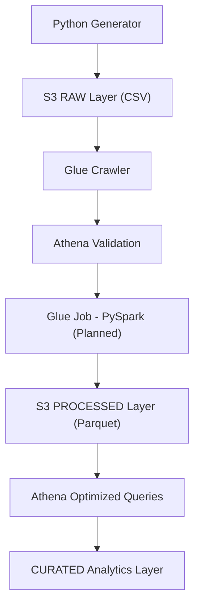

# Data Engineering Project

This project simulates an end-to-end e-commerce data pipeline on AWS, starting with synthetic data generation and moving toward a multi-layer data lake architecture. The current implementation already covers local data generation, raw ingestion to Amazon S3, cataloging with AWS Glue, and validation with Amazon Athena.

The next phase is to transform the raw CSV files into partitioned Parquet datasets and build curated analytics tables for business reporting.

## Project Goal

The main objective of this project is to build a practical Data Engineering workflow that includes:

- Synthetic e-commerce data generation
- Raw data ingestion into Amazon S3
- Data lake organization with partitioning
- Metadata cataloging with AWS Glue
- Query validation with Amazon Athena
- Future ETL and analytics layers for optimized consumption

## Current Pipeline



## What Has Already Been Implemented

### 1. Synthetic Data Generation

The project includes a Python-based synthetic data generator focused on an e-commerce scenario.

Generated entities:

- `customers`
- `orders`
- `products`
- `payments`
- `order_items`

The generator creates:

- A fixed customer base
- A fixed product catalog
- Daily transactional data for orders, order items, and payments
- Daily snapshot files stored locally as CSV

The generated files follow this naming pattern:

```text
random_date/YYYY-MM-DD-customers.csv
random_date/YYYY-MM-DD-products.csv
random_date/YYYY-MM-DD-orders.csv
random_date/YYYY-MM-DD-order_items.csv
random_date/YYYY-MM-DD-payments.csv
```

### 2. Data Ingestion to Amazon S3

A separate Python script uploads the generated files to Amazon S3 using `boto3`.

Current ingestion features:

- Automated upload to S3
- Parallel upload execution for better throughput
- Bucket configuration loaded from `.env`
- S3 organization by entity and ingestion date

The RAW layer follows a Hive-style partitioning layout:

```text
raw/<entity>/year=YYYY/month=MM/day=DD/<entity>.csv
```

Example:

```text
raw/orders/year=YYYY/month=MM/day=DD/orders.csv
```

### 3. RAW Data Lake Organization

The raw data lake has already been organized with:

- One folder per entity
- Date-based partitions
- CSV files stored in a structure compatible with Glue crawlers and Athena queries

This organization improves discoverability and enables partition-based filtering in Athena.

### 4. IAM Access Configuration

The AWS access layer has already been configured.

Completed steps:

- IAM user creation
- Access key and secret key generation
- Permission adjustments for Python-based S3 uploads
- Permission adjustments for AWS Glue access to S3

### 5. Cataloging with AWS Glue and Athena

The raw data was cataloged in AWS using Glue.

Completed steps:

- Glue database creation
- Glue crawler execution
- Table creation in the Glue Data Catalog
- Fixes for schema and partition recognition issues

### 6. Validation with Amazon Athena

The RAW layer has already been validated through Athena queries.

Validation already performed:

- Query execution against raw tables
- Partition-aware filtering
- Confirmation that raw data is readable and queryable

## Current Repository Structure

```text
.
|-- README.md
|-- main.py
|-- upload_s3.py
|-- .env
`-- random_date/
    |-- YYYY-MM-DD-customers.csv
    |-- YYYY-MM-DD-products.csv
    |-- YYYY-MM-DD-orders.csv
    |-- YYYY-MM-DD-order_items.csv
    `-- YYYY-MM-DD-payments.csv
```

## How the Current Process Works

1. `main.py` generates synthetic e-commerce data for the current month up to the execution date.
2. The files are stored locally inside the `random_date/` folder.
3. `upload_s3.py` reads the local files and uploads them to Amazon S3.
4. The S3 RAW layer stores data partitioned by year, month, and day.
5. AWS Glue crawlers scan the RAW folders and update the Data Catalog.
6. Amazon Athena queries validate the raw datasets.

## Technologies Used

- Python
- Pandas
- Boto3
- Python Dotenv
- Amazon S3
- AWS IAM
- AWS Glue
- Amazon Athena

## How to Run the Current Local Scripts

### Prerequisites

Before running the project locally, make sure you have:

- Python installed
- Required Python libraries available
- AWS credentials configured for `boto3`
- An existing S3 bucket
- A `.env` file with the bucket name

Example `.env`:

```env
BUCKET_NAME=your-bucket-name
```

### Run the Generator

```bash
python main.py
```

This command generates CSV files for all entities and stores them in the `random_date/` directory.

### Upload Files to S3

```bash
python upload_s3.py
```

This command uploads the local CSV files to the RAW zone in S3 using partitioned paths.

## Current Project Status

- Data generation: completed
- S3 ingestion: completed
- RAW data lake organization: completed
- Glue cataloging: completed
- Athena validation: completed
- ETL to PROCESSED layer: pending
- CURATED analytics layer: pending

## What Will Be Built Next

### 1. ETL to Convert CSV into Parquet

The next technical milestone is the creation of a Glue Job using PySpark.

Planned ETL responsibilities:

- Read CSV files from the RAW layer
- Apply data typing
- Remove duplicates
- Clean invalid values
- Save the result as Parquet

Target structure:

```text
processed/<entity>/year=YYYY/month=MM/day=DD/*.parquet
```

Example:

```text
processed/orders/year=YYYY/month=MM/day=DD/part-*.parquet
```

### 2. New Catalog Layer for Processed Data

After the Parquet conversion, a new crawler will be created for the `processed/` prefix.

Expected outputs:

- `processed_orders`
- `processed_customers`
- `processed_products`
- `processed_payments`
- `processed_order_items`

### 3. Query Optimization

With Parquet and partitions in place, Athena queries should become:

- Faster
- Cheaper
- More efficient for analytics workloads

### 4. CURATED Analytics Layer

The final analytical layer will contain business-ready datasets such as:

- Monthly revenue
- Average ticket
- Top-selling products
- Sales by channel

### 5. Data Modeling

The project is expected to evolve into a dimensional model with fact and dimension tables, for example:

- `fact_orders`
- `dim_customers`
- `dim_products`

### 6. Automation

Future automation goals include:

- Scheduled pipeline execution
- Recurring ETL jobs
- Continuous ingestion simulation

### 7. Optional Streaming Extension

As an advanced extension, the project may include a real-time ingestion layer using:

- Amazon Kinesis
- Apache Kafka

## Recommended Next Step

The recommended next step is to build the first AWS Glue Job to convert RAW CSV files into partitioned Parquet datasets with the correct schema and data types.

Once that is complete, the project will be ready to move from raw validation into optimized analytical processing.
